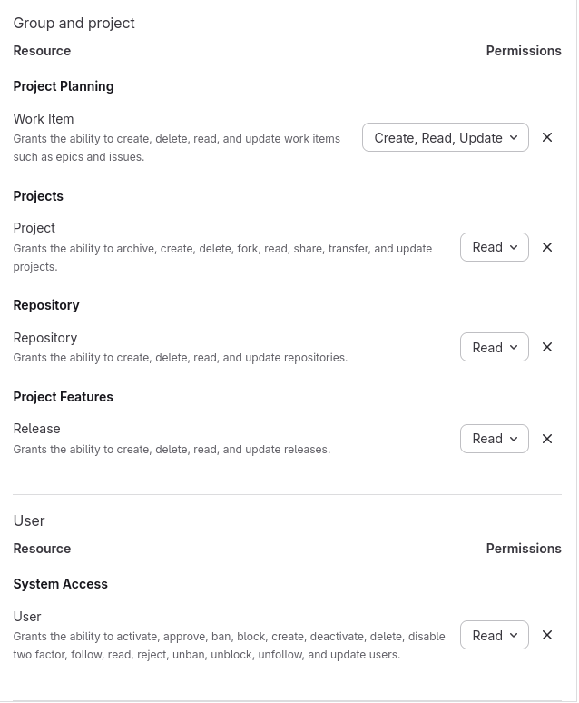

# Retoki

Generate release documentation for OpenTalk.

This tool will collect release notes from all components making up an OpenTalk product release.
A product release version consists of multiple component versions.

Creating a release is done by following these steps:

1. add the new product release to the `release.yaml`
   e.g. in the example `release.yaml` 2.8.0 would be a product release.

2. fetch changelogs
   `GITLAB_TOKEN=$(cat ~/.gitlab_token) retoki release 2.8.0 fetch-changelogs`

   This will query the changelogs from the gitlab release entries of the components.

3. fetch product tickets
   `GITLAB_TOKEN="$(cat ~/.gitlab_token)" retoki release 2.8.0 fetch-product-tickets`

   This will query the product changelog from all product work items with the `release-2.8.0` tag.

4. generate documentation
   `retoki generate 2.8`

   Render the release documentation.

## Example `release.yaml`

```yaml
product_name: OpenTalk
releases_page_header: |
  ## Release Announcements
series:
  "24.8":
    end_of_life: 2024-09-19
    releases:
      24.8.0:
        date: 2024-07-19
        components:
          controller: 0.16.0
components:
  controller:
    name: OpenTalk Controller Community Edition
    category: services
    releases: {}
component_categories:
  services:
    name: Services
```

## Profiles

A profile provides context-dependent information for the components listed in
`releases.yml`. The same product release can then be rendered or automated with different
audiences and repositories in mind.

Profiles are selected via `--profile <path>` (or the `RETOKI_PROFILE_PATH` environment variable)
on every command that reads a profile.

### Example `retoki-profiles/gitlab.yml`

```yaml
# Human-readable name of the profile, used in error messages.
profile_name: GitLab

# Per-profile configuration for components that release on their own, keyed by the
# component identifier used in `releases.yml`.
components:
  obelisk:
    # Repository URL used to build links and to look up changelogs / issue templates.
    gitlab_url: https://git.opentalk.dev/opentalk/backend/services/obelisk
    # Base URL for the component's container images.
    container_base_url: registry.opentalk.dev/opentalk/backend/services/obelisk
    # When `true`, the component is omitted from the generated documentation for this
    # profile.
    private: true

# Optional map of component groups. All components in a group are bumped to the same
# version and share a single release issue in the group's repository.
groups:
  frontend-and-controller:
    # Name used when creating the shared release issue.
    name: Frontend & Controller
    # Repository the shared release issue is created in.
    gitlab_url: https://git.opentalk.dev/opentalk/product/frontend-and-controller
    # Members of the group, keyed by the component identifier used in `releases.yml`.
    # Each member accepts the same per-component fields as a standalone entry above.
    components:
      web-frontend:
      controller:
```

With this profile:

- `retoki release 2.8.0 add frontend-and-controller -c <version> --profile gitlab` bumps
  both `web-frontend` and `controller` to `<version>` and creates a single release issue
  in the group repository.

## Release ticket automation

In addition to generating documentation, `retoki` can manage the GitLab issues that track a
product release.

### Configuration

The automation commands (`ci` and `release <version> init`) talk to a GitLab instance. They are
configured, in order of increasing precedence, via a `retoki.toml` file, `RETOKI_` prefixed
environment variables, and the `GITLAB_TOKEN` environment variable:

| Setting              | `retoki.toml` key   | Environment variable       | Default                     |
| -------------------- | ------------------- | -------------------------- | --------------------------- |
| GitLab base URL      | `gitlab_url`        | `RETOKI_GITLAB_URL`        | `https://git.opentalk.dev`  |
| GitLab group         | `gitlab_group`      | `RETOKI_GITLAB_GROUP`      | `opentalk`                  |
| GitLab token         | `gitlab_token`      | `GITLAB_TOKEN`             | _(required)_                |
| Release ticket label | `release_label`     | `RETOKI_RELEASE_LABEL`     | `release-ticket`            |
| Release repository   | `release_repo`      | `RETOKI_RELEASE_REPO`      | `opentalk/product-releases` |
| `releases.yml` path  | `releases_yml_path` | `RETOKI_RELEASES_YML_PATH` | `./releases.yml`            |

#### Required access token scopes

`retoki` authenticates against GitLab with a personal, project, or group access token. When using a
[fine-grained personal access token](https://docs.gitlab.com/auth/tokens/fine_grained_access_tokens/),
grant the following resource permissions (boundary: **Group and project**):

| Permission          | Access | Used for                                                          |
| ------------------- | ------ | ----------------------------------------------------------------- |
| **User**            | Read   | Initial connection check (`GET /api/v4/user`)                     |
| **Project**         | Read   | Resolving project namespace and path                              |
| **Repository**      | Read   | Reading raw repository files (e.g. issue templates)               |
| **Release**         | Read   | `fetch-changelogs`: reading component release notes               |
| **Work Item**       | Read   | Searching and reading release/product issues and their links      |
| **Work Item**       | Create | `init` / `ci`: creating release issues and issue links            |
| **Work Item**       | Update | `init` / `ci`: updating release issue descriptions                |

The read-only commands (`fetch-changelogs`, `fetch-product-tickets`) only need the **Read**
permissions above. The `init` and `ci` commands additionally require **Work Item: Create** and
**Work Item: Update**. When using a legacy (non fine-grained) token, `read_api` covers the
read-only commands, while `api` is required for `init` and `ci`.

<details>
<summary>Token Configuration on GitLab UI</summary>



</details>

### `retoki release <version> init`

Create or update the product release issue for a version in the release tickets project:

`GITLAB_TOKEN=$(cat ~/.gitlab_token) retoki release 2.8.0 init`

This seeds the release entry in `releases.yml` from the previous release (if necessary), builds
the component version table and creates or updates the corresponding GitLab issue.

### `retoki ci`

Run tasks intended to be executed in a CI pipeline. Currently this updates the dependency graphs
in all open release tickets:

`GITLAB_TOKEN=$(cat ~/.gitlab_token) retoki ci`

Both commands accept `--dry-run` (or `RETOKI_DRY_RUN=true`) to log the actions that would be
performed without writing anything to GitLab.

### `retoki release <version> announce`

Render a release announcement as plain text, suitable for email and mailing lists that are also
published on the web:

`retoki release 2.8.0 announce`

Hyperlinks are retained inline in angle brackets and Markdown release notes (including tables and
footnotes) are converted to plain text, so no further post-processing is required.
